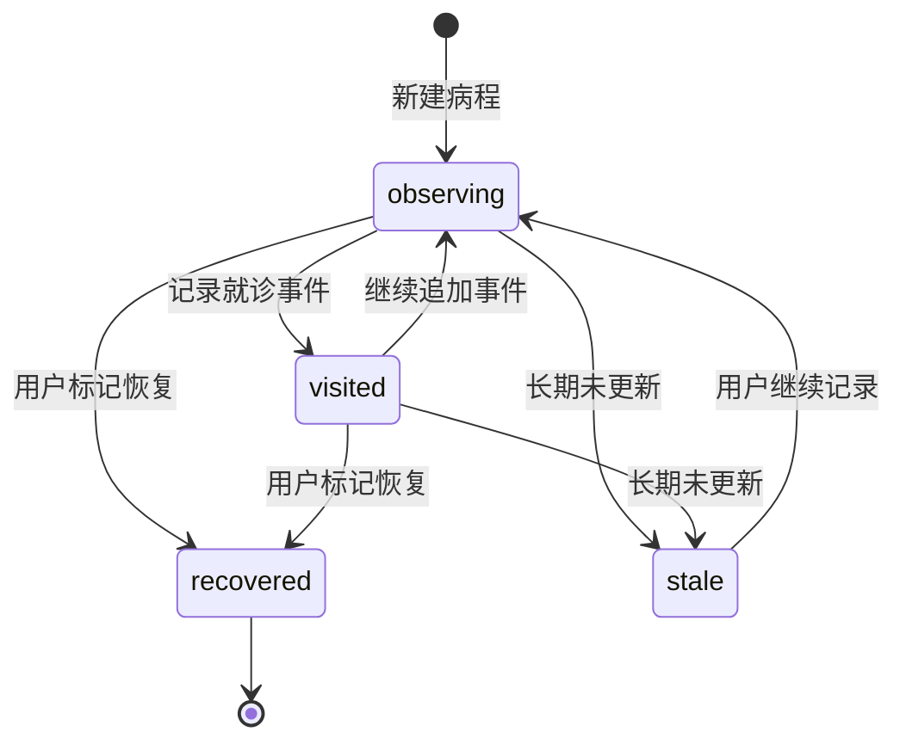
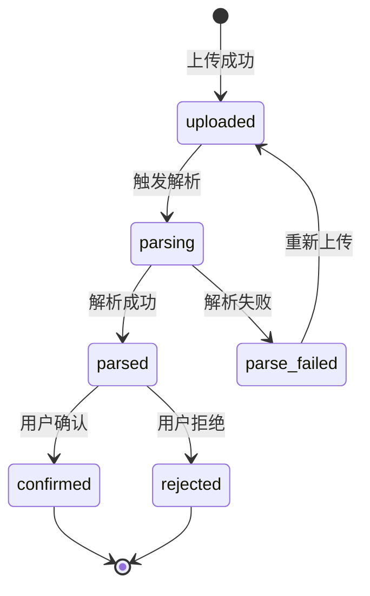
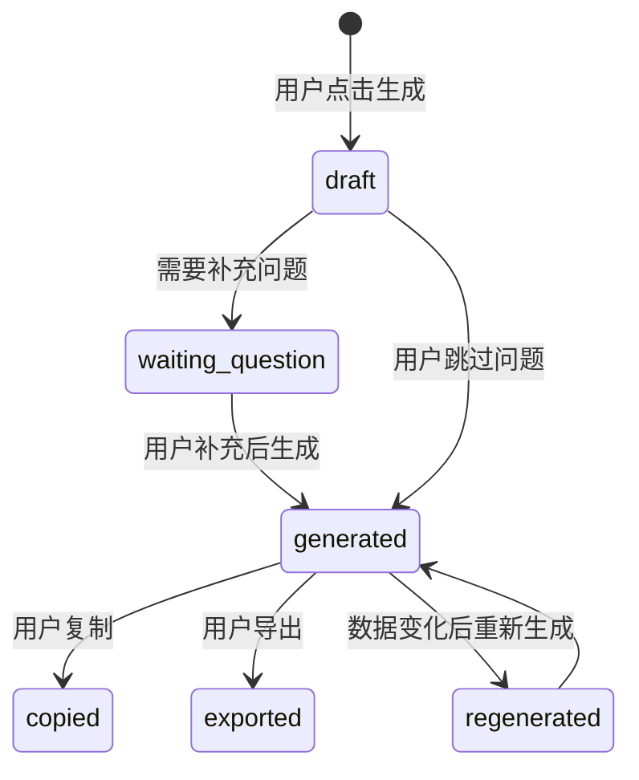

# 家人健康记｜核心状态机

## 1. 病程状态机

```mermaid
stateDiagram-v2
    [*] --> observing: 新建病程
    observing --> visited: 记录就诊事件
    observing --> recovered: 用户标记恢复
    visited --> observing: 继续追加事件
    visited --> recovered: 用户标记恢复
    observing --> stale: 长期未更新
    visited --> stale: 长期未更新
    stale --> observing: 用户继续记录
    recovered --> [*]
```

## 2. 附件状态机

```mermaid
stateDiagram-v2
    [*] --> uploaded: 上传成功
    uploaded --> parsing: 触发解析
    parsing --> parsed: 解析成功
    parsing --> parse_failed: 解析失败
    parsed --> confirmed: 用户确认
    parsed --> rejected: 用户拒绝
    parse_failed --> uploaded: 重新上传
    confirmed --> [*]
    rejected --> [*]
```

## 3. 复诊摘要状态机

```mermaid
stateDiagram-v2
    [*] --> draft: 用户点击生成
    draft --> waiting_question: 需要补充问题
    waiting_question --> generated: 用户补充后生成
    draft --> generated: 用户跳过问题
    generated --> copied: 用户复制
    generated --> exported: 用户导出
    generated --> regenerated: 数据变化后重新生成
    regenerated --> generated
```

## 4. 设计约束

1. `uploaded` 和 `parsed` 阶段的附件，不得进入正式复诊摘要。
2. `recovered` 病程默认不再作为首页进行中病程展示。
3. `generated` 摘要必须记录所依据的数据版本，避免数据后改而摘要失真。
